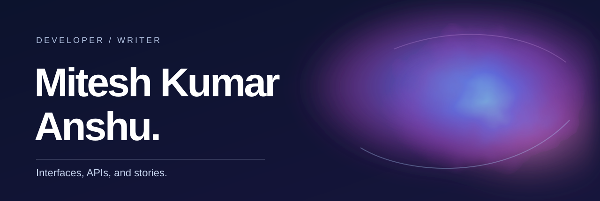
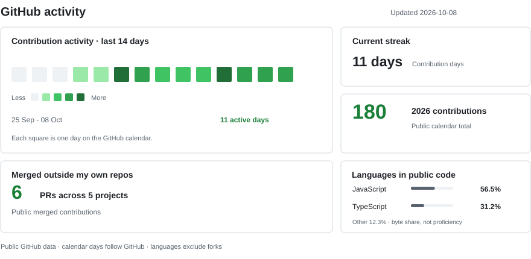

  
  
  
  
  
  
  
  

<picture>
  <source media="(prefers-color-scheme: dark)" srcset="./assets/github-activity-dark.svg">
  <source media="(prefers-color-scheme: light)" srcset="./assets/github-activity-light.svg">
  
</picture>

Open to full-time roles in Delhi NCR (or remote).

### Merged open-source work

<!-- merged-prs:start -->
[PdfZero #9](https://github.com/bevinkatti/PdfZero/pull/9) · [career-ops #4728](https://github.com/career-ops-hq/career-ops/pull/4728) · [Platypus #1149](https://github.com/willdady/platypus/pull/1149) · [RoleCraft #360](https://github.com/rolecraft-sh/rolecraft/pull/360), [#365](https://github.com/rolecraft-sh/rolecraft/pull/365)
<!-- merged-prs:end -->

I build web apps, and I write stories. The work is different, but I keep coming back to the same question: what belongs here, and what can I leave out?

My usual stack is **React, Node.js, Express and PostgreSQL**. I also write Java. I care about the small decisions between the screen and the database - the parts that either make a product feel easy or get in someone's way.

### The work

**01 / [CircuLib](https://github.com/miteshanshu/Library-Management-System---RBAC)**  
A library system built around the people who use it: students, librarians and admins. React, Express and PostgreSQL; separate workflows for loans, returns and overdue items.

**02 / [Shringaar Studio](https://shringaar-studio-site.vercel.app/)**  
A photo-led React site for a nail studio. I wanted the studio's actual work to carry the page, not a wall of generic salon copy. [See the code](https://github.com/miteshanshu/shringaar-studio-site). This is a concept for studio review, not its approved website.

**03 / [Smart Billing Engine](https://github.com/miteshanshu/java-oop-billing-engine)**  
A smaller Java project about a deceptively tricky thing: how billing and discount rules should fit together.

[DevForge](https://github.com/miteshanshu/DevForge) is another work in progress - a place for developers to share projects and build logs.

### Away from the editor

I write fiction as **ANSHU**. *Sukoon* is my debut novel, and *Teen Kinare*, a Hindi novella, is in progress. It gives me another way to think about pacing and what to leave out.

If something here speaks to you, [email me](mailto:miteshanshu1@gmail.com) or find me on [LinkedIn](https://linkedin.com/in/miteshanshu).
